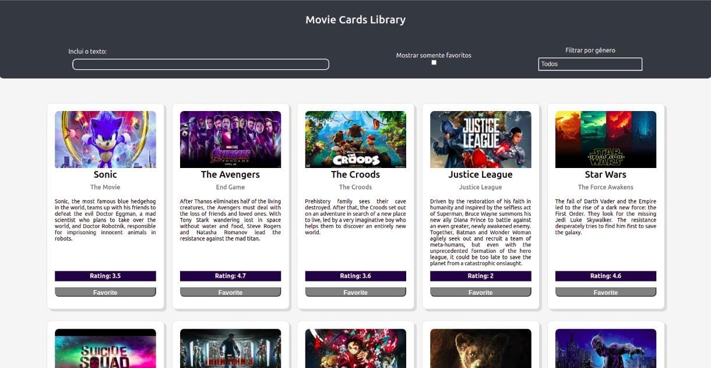

# Movie List

### (Constantly changing project)

---

---

## About project

[Project's Page](https://murilo-rainho.github.io/movie-list/)

This project was made during my third week in the third month on the Trybe Course. After two months studying *pure javascript*, I started to learn **react** and did this project with the knowledge of just one week of react.

---

### what is the site for?

This site is just to demonstrate my knowledge of *react*, using some **class components** and a **fake movie API**. On the site, you simply browse it and see some interesting information from my favorite movies. *;)*

---

### HTML

I used *react's default HTML*.

---

### CSS

In the CSS, I used basic knowledges like:
* `display: flex;`
* Responsiveness;
* Pseudo-class.

---

### ReactJS

I used knowledge that I learned in a few days of react:
* Class components;
* Manipulation of the `this` and `props` object.

---
